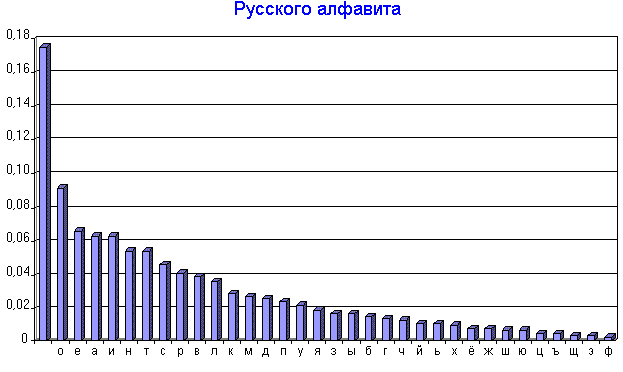
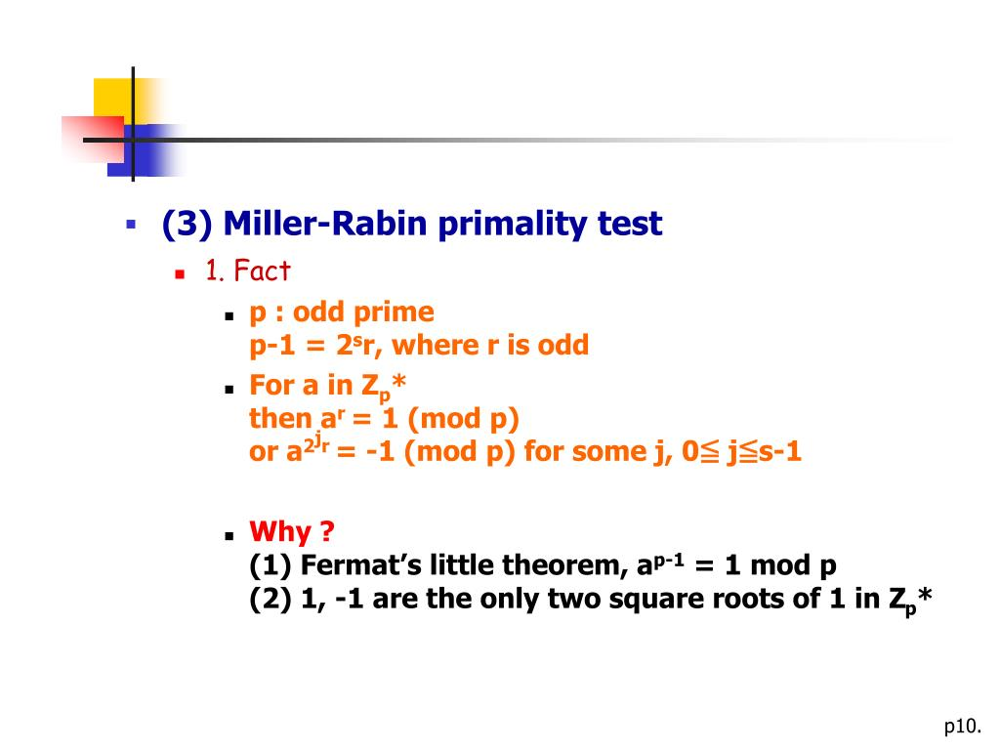

# Implementation of encryption algorithms
There are too many comments in Russian in the code, but this is to get a good grade.

The further - the more difficult the tasks and the better the code)
## Structure
- [Cesarean code](#cesar)
- [Substitution cipher](#substitution-cipher)
- [Frequency analysis](#frequency-analysis)

- [Miller–Rabin primality test](#miller-rabin)
- [RSA client-server socket app](#rsa)

### Cesarean code

PATH: /cesar
The console application can work in several modes:
- encryption with step d
- decryption
- brute force

### Substitution cipher

PATH: /substitution_cipher
The console application can work in several modes:
- random encryption table generation
- text encryption
- text decryption

### Frequency analysis

PATH: /frequency_analysis
The console application can work in several modes:
- random encryption table generation
- text encryption
- scenario to evaluate the effectiveness of frequency analysis
- scenario to crack the substitution cipher manually

### Miller–Rabin primality test

PATH: /miller-rabin_primary_test
The console application can work in several modes:
- check numbers from file
- check nubers from console input
- check number with client-server console app on sockets
  - first start server(main.py) then client(client.py)

### RSA client-server socket app

PATH: /rsa
The console application can work in several modes:
- chipher functions on encryption.py
- rsa chat with client-server console app on sockets
  - first start server(main.py) then client(client.py) then client1.py